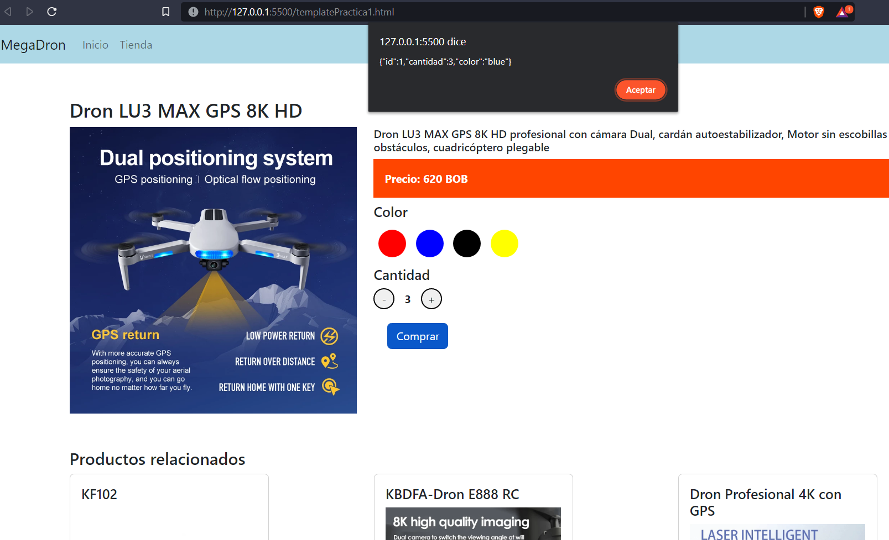

# MÓDULO 6 - VUEJS
# Integrantes
1. Edy Felix Tarqui Guarachi  CI:. 6154087 LP
2. Elmer Mamani Ticona        CI:. 8418037 LP
# PRACTICA 1:
1. Propósito: Demostrar los conocimientos adquiridos en la creación de un proyecto en
vuejs.
2. Requerimientos:
- Cambiar el título de la página a: MegaDron
- Con menuColor cambiar el color de fondo del menubar
- Con footerColor cambiar el fondo del pie de pagina
- Mostrar en el menubar los menus del arreglo menus
- Con precioEstilos cambiar los estilos del div de precios
- Cambios seccion producto
- Cambios sección productos relacionados
- Comprar un producto
    En la sección de producto se deberá elegir el color y la cantidad del producto.
    Al presionar el botón de comprar deber mostrarse en un alert el el siguiente contenido:
    - id del producto
    - La cantidad
    - Color seleccionado
    
    Esta informacion debera estar en el objeto pedido
```
pedido
{
id:null,
cantidad: 1,
color:null
}
```
- Boton comprar 
    El botón de comprar debe permanecer deshabilitado mientras no se tenga una cantidad
    mayor igual a 1 y un color seleccionado

### `POST`

El resultado esperado es el siguiente:



